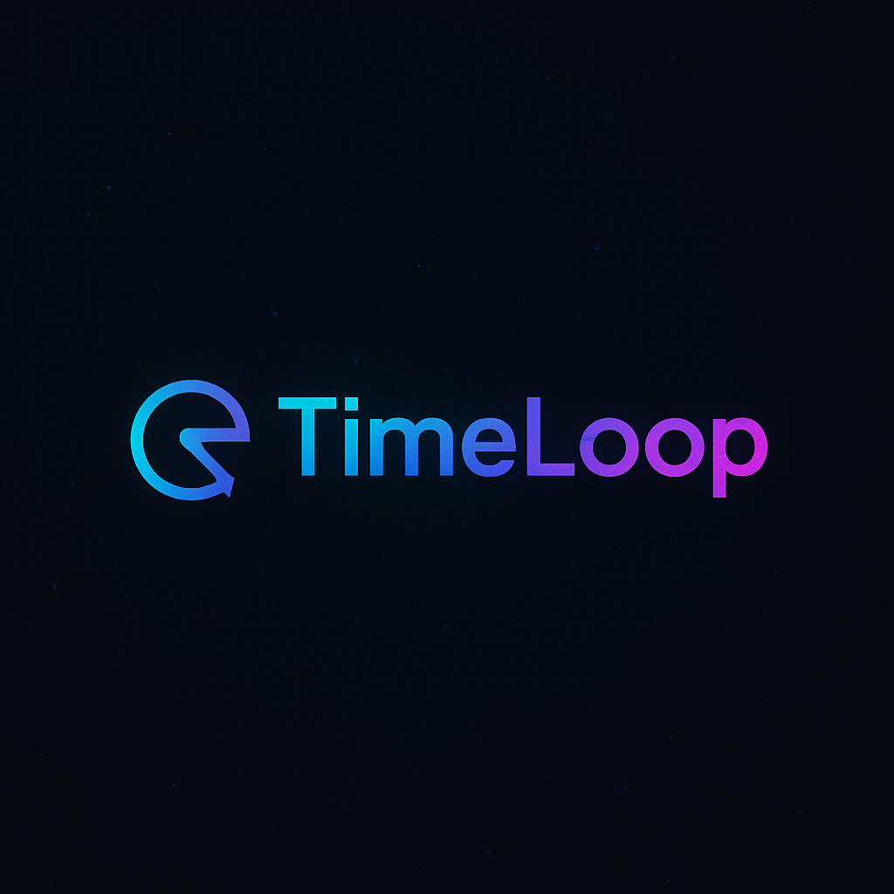

# Time-Loop 📱

<div align="center">



A modern social media platform built with React, featuring an intuitive UI and engaging features.

[](https://reactjs.org/)
[](https://vitejs.dev/)


</div>

** https://time-loop-psi.vercel.app

## ✨ Features

- 🏠 **Home Feed** - Browse and interact with posts
- 🎥 **Reels** - Watch and create short-form videos
- 🔍 **Search** - Discover users and content(Under Development)
- 👤 **User Profiles** - Customize your presence
- 📱 **Responsive Design** - Seamless experience across devices

## 🛠️ Tech Stack

- **Frontend Framework:** React.js
- **Build Tool:** Vite
- **Styling:** CSS3
- **Routing:** React Router DOM
- **Icons:** Font Awesome
- **Package Manager:** npm

## 🚀 Getting Started

### Prerequisites

- Node.js (v14.0.0 or higher)
- npm (v6.0.0 or higher)

### Installation

1. **Clone the repository**
   ```bash
   git clone https://github.com/aryan2729/Time-Loop.git
   ```

2. **Navigate to project directory**
   ```bash
   cd Time-Loop
   ```

3. **Install dependencies**
   ```bash
   npm install
   ```

4. **Start development server**
   ```bash
   npm run dev
   ```

   After running the development server, click on the Network link that appears in your terminal (e.g., http://192.128.3.8:5177/)


## 📁 Project Structure

```
Time-Loop/
├── src/
│   ├── components/          # Reusable components
│   │   ├── Layout.jsx
│   │   └── Layout.css
│   ├── pages/              # Page components
│   │   ├── Home/
│   │   ├── Reels/
│   │   ├── Search/
│   │   ├── Account/
│   │   └── Error/
│   ├── App.jsx            # Main application component
│   ├── App.css            # Global styles
│   ├── main.jsx           # Application entry point
│   └── index.css          # Base styles
├── public/                # Static assets
│   └── assets/
├── index.html            # HTML template
├── package.json          # Project dependencies
├── vite.config.js        # Vite configuration
└── README.md            # Project documentation
```

## 🔍 Features in Detail

### Home Feed
- 📸 View posts with images
- ❤️ Like and comment functionality
- 👥 Follow/unfollow users
- 📊 View engagement metrics

### Reels
- 🎬 Watch short-form videos
- 💬 Interactive comments
- 👥 Follow content creators

### Search
- 🔎 Search (Under Development)
- 📱 Grid layout results

### User Profile
- 👤 Profile customization
- 📸 Post management
- ⚙️ Settings control
- 👥 Social connections


## 🤝 Contributing

We welcome contributions! Please follow these steps:

1. Fork the repository
2. Create your feature branch (`git checkout -b feature/AmazingFeature`)
3. Commit your changes (`git commit -m 'Add some AmazingFeature'`)
4. Push to the branch (`git push origin feature/AmazingFeature`)
5. Open a Pull Request


## 🙏 Acknowledgments

- [React.js](https://reactjs.org/) - The web framework used
- [Vite](https://vitejs.dev/) - The build tool
- [Font Awesome](https://fontawesome.com/) - The icon library
- All contributors who have helped shape this project

---

<div align="center">
Made with ❤️ by Aryan
</div>
